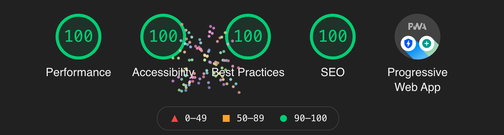

フリーランス（個人事業主）として活動していくにあたり、屋号ドメインで事業用のWebサイトを作りました。
技術的な発信などもこちらで行っていく予定です。

URLをのせた名刺はかなり前に完成していたので、やっと名刺を完全体にすることが出来ましたw

## 事業の屋号はbeyooon（ビヨーン）

- 前向きな印象
- 遊び心

といった要素を屋号に盛り込みたいなと思い、バネが伸びるイメージで**「beyooon（ビヨーン）」**と付けました。
響きに遊び心もあってなかなか気に入ってます。
「～を越えて」といった意味で英単語のbeyondともかけています。

遊び心や好奇心を大切にしながら、「びよ〜ん」と日々前に進んでいきたいと思います。

## Web制作やアプリ開発を中心に活動

新しい技術を使ってチャレンジングに活動していきたいと考えています。

具体的には、

- WordPressを使わない爆速Web制作（このサイトがそうです）
- Flutterを使ったiOS/Androidアプリケーション開発
- Laravelを使ったWebアプリケーション開発

を行っていく予定です。

これらに興味のある方や仕事を頼みたい方は[お問い合わせ](/contact)から連絡をいただければ嬉しいです。

仕事ください。（切実）

## このWebサイトでこだわったところ

### Gatsby製の爆速サイト

このサイトはReactの静的サイトジェネレーターであるGatsbyという技術を使って作りました。
技術的な詳しい部分は他の記事で紹介したいと思いますが、Web制作で主流となっているサーバーにWordPressをインストールする方法と比べて、**高速かつセキュリティーも高い**です。

こちらはWebサイトをGoogleが評価してくれるLighthouseの結果ですが、このWebサイトは**全ての項目で満点**となっています。

前々からこの構成で作ってみたかったので、やっと実現できました。

### ダークモードの切替

右上のメニューバーの切替ボタンからダークモードを切り替えることが出来るようにしました。
（右上にボタンがない場合は上に少しスクロールするとヌルッとメニューバーが現れると思います）

バッテリー消費が気になる方などはぜひダークモードに切り替えてもらえればと思います。

### 機能はさらに充実させていく予定

- 制作実績ページ
- 全文検索
- ブログをカテゴリーで絞り込み
- ブログをタグで絞り込み

などなど追加したい事がまだあるので、徐々に作り込んでいくつもりです。

## 最後に

技術的な知見や事業に関係すること、その他雑記などこちらで発信していきたいと思いますので、今後ともよろしくお願いします。
